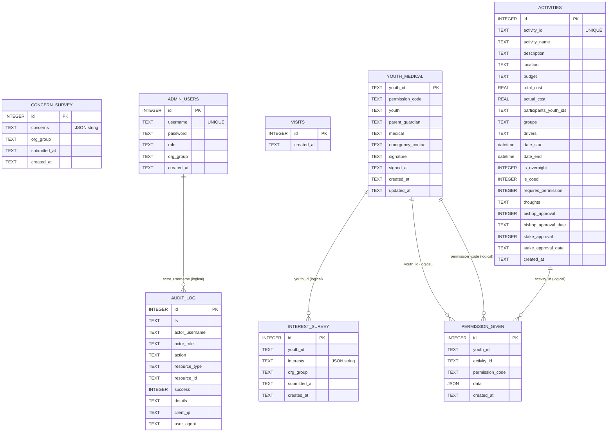
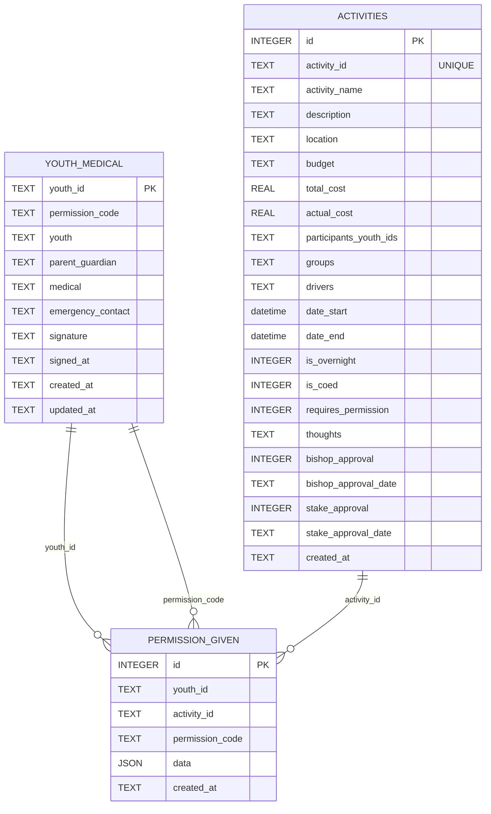

# Database
The system uses a relational database in the backend.  Currently this is SQLITE.

## Diagram

```mermaid
erDiagram
  INTEREST_SURVEY {
    INTEGER id PK
    TEXT youth_id
    TEXT interests "JSON string"
    TEXT org_group
    TEXT submitted_at
    TEXT created_at
  }

  CONCERN_SURVEY {
    INTEGER id PK
    TEXT concerns "JSON string"
    TEXT org_group
    TEXT submitted_at
    TEXT created_at
  }

  ADMIN_USERS {
    INTEGER id PK
    TEXT username "UNIQUE"
    TEXT password
    TEXT role
    TEXT org_group
    TEXT created_at
  }

  VISITS {
    INTEGER id PK
    TEXT created_at
  }

  YOUTH_MEDICAL {
    TEXT youth_id PK
    TEXT permission_code
    TEXT youth
    TEXT parent_guardian
    TEXT medical
    TEXT emergency_contact
    TEXT signature
    TEXT signed_at
    TEXT created_at
    TEXT updated_at
  }

  ACTIVITIES {
    INTEGER id PK
    TEXT activity_id "UNIQUE"
    TEXT activity_name
    TEXT description
    TEXT location
    TEXT budget
    REAL total_cost
    REAL actual_cost
    TEXT participants_youth_ids
    TEXT groups
    TEXT drivers
    datetime date_start
    datetime date_end
    INTEGER is_overnight
    INTEGER is_coed
    INTEGER requires_permission
    TEXT thoughts
    INTEGER bishop_approval
    TEXT bishop_approval_date
    INTEGER stake_approval
    TEXT stake_approval_date
    TEXT created_at
  }

  PERMISSION_GIVEN {
    INTEGER id PK
    TEXT youth_id
    TEXT activity_id
    TEXT permission_code
    JSON data
    TEXT created_at
  }

  AUDIT_LOG {
    INTEGER id PK
    TEXT ts
    TEXT actor_username
    TEXT actor_role
    TEXT action
    TEXT resource_type
    TEXT resource_id
    INTEGER success
    TEXT details
    TEXT client_ip
    TEXT user_agent
  }

  %% Logical relationships (not enforced by foreign keys in the DDL)
  YOUTH_MEDICAL ||--o{ INTEREST_SURVEY : "youth_id (logical)"
  YOUTH_MEDICAL ||--o{ PERMISSION_GIVEN : "youth_id (logical)"
  ACTIVITIES   ||--o{ PERMISSION_GIVEN : "activity_id (logical)"
  YOUTH_MEDICAL ||--o{ PERMISSION_GIVEN : "permission_code (logical)"
  ADMIN_USERS  ||--o{ AUDIT_LOG : "actor_username (logical)"
```

## Relationships

```mermaid
erDiagram
  YOUTH_MEDICAL {
    TEXT youth_id PK
    TEXT permission_code
    TEXT youth
    TEXT parent_guardian
    TEXT medical
    TEXT emergency_contact
    TEXT signature
    TEXT signed_at
    TEXT created_at
    TEXT updated_at
  }

  ACTIVITIES {
    INTEGER id PK
    TEXT activity_id "UNIQUE"
    TEXT activity_name
    TEXT description
    TEXT location
    TEXT budget
    REAL total_cost
    REAL actual_cost
    TEXT participants_youth_ids
    TEXT groups
    TEXT drivers
    datetime date_start
    datetime date_end
    INTEGER is_overnight
    INTEGER is_coed
    INTEGER requires_permission
    TEXT thoughts
    INTEGER bishop_approval
    TEXT bishop_approval_date
    INTEGER stake_approval
    TEXT stake_approval_date
    TEXT created_at
  }

  PERMISSION_GIVEN {
    INTEGER id PK
    TEXT youth_id
    TEXT activity_id
    TEXT permission_code
    JSON data
    TEXT created_at
  }

  %% Core workflow relationships (logical, not enforced by FK constraints)
  YOUTH_MEDICAL ||--o{ PERMISSION_GIVEN : "youth_id"
  ACTIVITIES   ||--o{ PERMISSION_GIVEN : "activity_id"
  YOUTH_MEDICAL ||--o{ PERMISSION_GIVEN : "permission_code"
```
